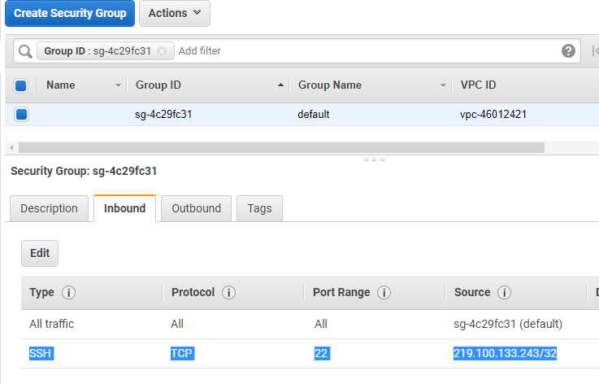
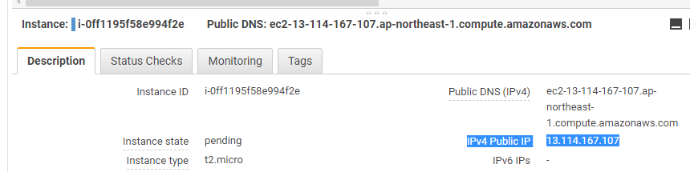

This repo summrazes a [compilation error](https://github.com/HewlettPackard/netperf/issues/35) I encountered when I tried to compile netperf with the `--enable-demo` flag on. I ran into this issue using Amazon Linux 2 on Amazon EC2. So the procedure to reproduce the error requires your AWS account.

## Prerequisite

- You have an AWS account and suffucient permission to create EC2
- EC2 key pair for SSH login 


- Your default security group in default VPC to allow SSH access from your local machine



## Steps to reproduce the compilation error:

`git clone` this repository:

```
git clone https://github.com/richardimaoka/netperf-compile.git
```

Run `aws-ec2.sh` with your EC2 key pair name to launch EC2, and allow SSH access with the key pair:

```
./aws-ec2.sh --aws-keypair demo-key-pair
```

The above shell script will run an EC2 instance and execute what's in the [`user-status.txt`](https://github.com/richardimaoka/netperf-compile/blob/master/user-data.txt). So the C compiler will be available and the netperf directory was retrieved and unarchived.

Wait for the EC2 instance to have the ok status:


Confirm the public IP address on AWS Web Console and SSH login to the EC2 instance:



```
ssh -i ~/.ssh/demo-key-pair.pem ec2-user@13.114.167.107
```

You can see the netperf was downloaded from [GitHub](https://github.com/HewlettPackard/netperf/releases) and unarchived as follows:

```
[ec2-user@ip-172-31-42-31 ~]$ pwd
/home/ec2-user
[ec2-user@ip-172-31-42-31 ~]$ ls -la
total 1964
drwx------ 4 ec2-user ec2-user     131 Jun 15 18:01 .
drwxr-xr-x 3 root     root          22 Jun 15 18:01 ..
-rw-r--r-- 1 root     root     1993943 Jun 15 18:01 netperf-2.7.0.tar.gz
drwxrwxr-x 5 root     root        4096 Jul 20  2015 netperf-netperf-2.7.0
```

Now let's try to compile netperf. Firstly, configure it with `--enabe-demo`:

```
> sudo ./configure --enable-demo
checking build system type... x86_64-unknown-linux-gnu
...
...
checking whether to include demo support... yes
...
config.status: executing depfiles commands
```

You can see that a message, `checking whether to include demo support... yes` is included.
Then try to compile it, but now you see an error as follows:

```
>sudo make
...
...
gcc     -o netperf netperf.o netlib.o netsh.o nettest_bsd.o nettest_dlpi.o nettest_unix.o nettest_xti.o nettest_sctp.o nettest_sdp.o nettest_omni.o net_uuid.o dscp.o netcpu_procstat.o  -lm
netlib.o: In function `demo_interval_final':
netlib.c:(.text+0x3de3): undefined reference to `demo_interval_display'
netlib.o: In function `demo_stream_interval':
netlib.c:(.text+0x3e09): undefined reference to `demo_interval_tick'
netlib.o: In function `demo_rr_interval':
netlib.c:(.text+0x3e7f): undefined reference to `demo_interval_tick'
nettest_omni.o: In function `send_omni_inner':
nettest_omni.c:(.text+0x83f0): undefined reference to `demo_interval_tick'
nettest_omni.c:(.text+0x8407): undefined reference to `demo_interval_tick'
nettest_omni.c:(.text+0x8430): undefined reference to `demo_interval_tick'
nettest_omni.o:nettest_omni.c:(.text+0x843c): more undefined references to `demo_interval_tick' follow
collect2: error: ld returned 1 exit status
```

This seems to be due to [this issue](https://stackoverflow.com/questions/16245521/c99-inline-function-in-c-file/16245669#16245669).
I could avoid the error by removing `inline` from `src/netlib.c`.
(i.e.) change [this](https://github.com/HewlettPackard/netperf/blob/netperf-2.7.0/src/netlib.c#L4000L4004):

```c
#ifdef WIN32
__forceinline void demo_interval_display(double actual_interval)
#else
  inline void demo_interval_display(double actual_interval)
#endif
{
```

into this:

```c
inline void demo_interval_display(double actual_interval)
```

and also [this](https://github.com/HewlettPackard/netperf/blob/netperf-2.7.0/src/netlib.c#L4063L4071):

```c
#ifdef WIN32
/* It would seem that the Microsoft compiler will not inline across
   source files. So there is little point in having an inline
   directive in that situation.  Of course that makes me wonder if an
   inline directive has to appear in netlib.h... */
void demo_interval_tick(uint32_t units)
#else
  inline void demo_interval_tick(uint32_t units)
#endif
{
```

into this:

```c
void demo_interval_tick(uint32_t units)
{
```

